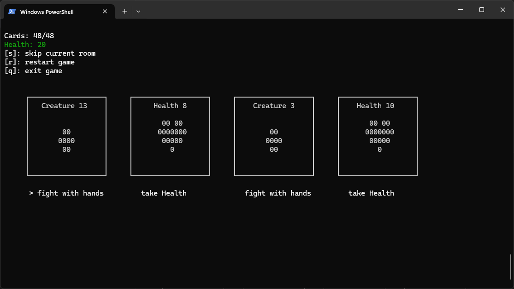

# About
This is a python terminal based implementation of the dungeon crawler card game [Scoundrel](http://www.stfj.net/art/2011/Scoundrel.pdf) by Zach Gage and Kurt Biek, based on a standard 54 card poker deck.



# Install
You have to first install the necessary packages:
```bash
pip install .
```

# Run
run the game in your terminal with:
```bash
scoundrel
```
Please make sure that the terminal window is big enough, otherwise some elements won't align. At the start you will get a message, if the screen is too small.

## Dependencies
[blessed](https://github.com/chjj/blessed)

# Game Rules
Each round you can choose to interact with 3 objects from 4 objects.
Possible objects are
- Weapon:
    - you can pick up a weapon, but it will replace the current weapon you have
- Creature:
    - you can fight a creature either with a weapon (if you have one) or by fist
- Health Potions:
    - health potions restore your health, but only up to your maximum health of 20

## Fighting Rules

- You can only fight a creature with your current weapon if its power is less than or equal to the last creature defeated with that weapon. You can see the defeated creates for the current weapon under "defeated creatures stack".
- If the creature’s strength exceeds your weapon’s power, the difference is dealt as damage to your health.
- Fighting a creature with your fists deals damage to your health equal to the creature’s strength.

## Skipping Rooms

- You may skip a room only if you have not interacted with any object in that room, and you cannot skip twice in a row.
- Skipping moves the current object to the bottom of the stack of cards, meaning you’ll encounter it again later.
- Use skipping strategically!

## Progression & End Conditions

- After interacting with 3 objects, you move to the next room. The first object you encounter in the new room is the last object from the previous room.
- You lose when your health reaches zero.
- You win by clearing all cards.
